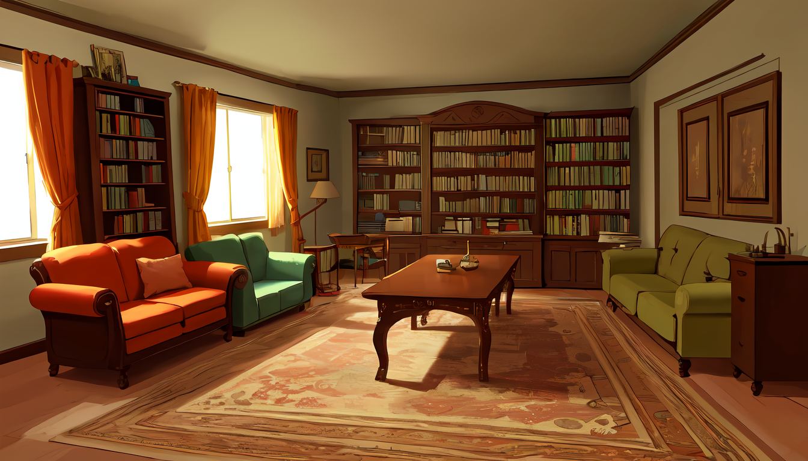

# シナリオシナリオシナリオ

{吾輩|わがはい}は猫である。**名前はまだない。**

どこで生まれたかとんと{見当|けんとう}がつかぬ。何でも薄暗いじめじめした所でニャーニャー泣いていたことだけは記憶している。吾輩はここで始めて人間というものを見た。しかもあとで聞くとそれは書生という人間中で一番{獰悪|どうあく}な種族であったそうだ。この書生というのはときどき我々を{捕|つかま}えて{煮|に}て食うという話である。しかしその当時は何という考もなかったから別段恐ろしいとも思わなかった。ただ彼の{掌|てのひら}に載せられてスーと持ち上げられた時何だかフワフワした感じがあったばかりである。掌の上で少し落ちついて書生の顔を見たのがいわゆる人間というものの{見始|み始め}であろう。このとき妙なものだと思った感じが今でも残っている。第一毛をもって装飾されべきはずの顔がつるつるしてまるで{薬缶|やかん}だ。その{後|ご}猫にもだいぶ{逢|あ}ったがこんな{片輪|方わ}には一度も{出会|でく}わしたことがない。のみならず顔の真中があまりに突起こしている。そうしてその穴の中からときどきぷうぷうと{煙|けむり}を吹く。どうも{咽|む}せぽくて実に弱った。これが人間の飲む{煙草|たばこ}というものであることはようやくこのころ知った。

## 始めに

リストの例を次に示していいですか？いいよあり

- hoge
- fugafugafugafugafugafugafugafugafugafugafugafugafugafugafugafuga
  - hoge
  - fugafugafugafugafugafugafugafugafugafugafugafugafugafugafugafuga
  - aiueo
- aiueo

1. ひとつ
1. 2つ2つ2つ2つ2つ2つ2つ2つ2つ2つ2つ2つ2つ2つ2つ2つ2つ2つ2つ
1. 3つ

### h3

#### h4

##### h5

###### h6

## キーパー向け情報

ふと気が付いて見ると書生はいない。たくさんおった兄弟が一{疋|ぴき}も見えぬ。{肝心|かんじん}の母親さえ姿を隠してしまった。そのうえ{今|いま}までの所とは違って{無暗|むやみ}に明るい。眼を明いていられぬくらいだ。はてな何でも{容子|ようす}がおかしいと、のそのそ{這|は}い出して見ると非常に痛い。吾輩は{藁|わら}の上から急に笹原の中へ棄てられたのである。

ようやくの思いで笹原を這い出すと向うに大きな池がある。吾輩は池の前に坐ってどうしたらよかろうと考えて見た。別にこれという{分別|ふんべつ}も出ない。しばらくして泣いたら書生がまた迎に来てくれるかと考え付いた。ニャー、ニャーと試みにやって見たが誰も来ない。そのうち池の上をさらさらと風が渡って日が暮れかかる。腹が非常に減って来た。泣きたくても声が出ない。しかたがない、何でもよいから{食物|くいもの}のある所まであるこうと決心をしてそろりそろりと池を{左|ひだ}りに廻り始めた。

memo

どうも非常に苦しい。（1/1d6）

うおおおおお！

### うおおおお

あいうえおかきくけこ！！！！！！！

## 導入

こんばんは！

## 結末

おはよう！おしまい！

<!-- textlint-disable -->
<!-- prettier-ignore -->
本作は、「 株式会社アークライト  」及び「株式会社KADOKAWA」が権利を有する『新クトゥルフ神話TRPG』の二次創作物です。

Call of Cthulhu is copyright ©1981, 2015, 2019 by Chaosium Inc. ;all rights reserved. Arranged by Arclight Inc.  
Call of Cthulhu is a registered trademark of Chaosium Inc.  
PUBLISHED BY KADOKAWA CORPORATION　「新クトゥルフ神話 TRPG ルールブック」

<!-- prettier-ignore -->
<!-- textlint-enable -->

